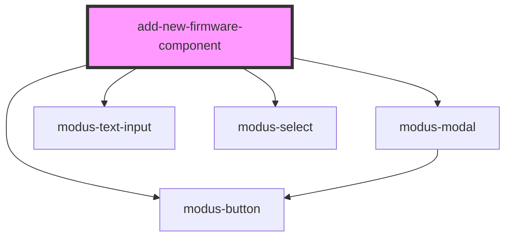

# add-new-firmware-component

<!-- Auto Generated Below -->

## Dependencies

### Depends on

- modus-button
- modus-modal
- modus-text-input
- modus-select

### Graph

----------------------------------------------

*Built with [StencilJS](https://stenciljs.com/)*
