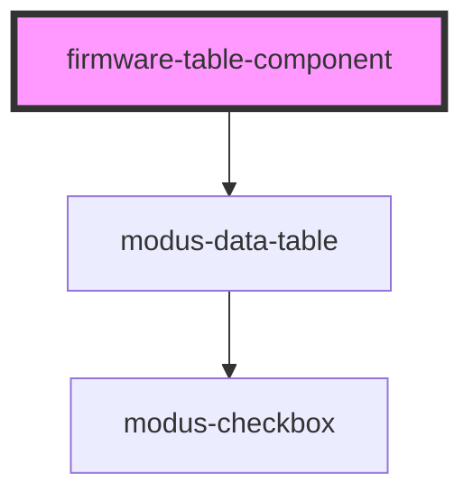

# firmware-table-component

<!-- Auto Generated Below -->

## Dependencies

### Depends on

- modus-data-table

### Graph

----------------------------------------------

*Built with [StencilJS](https://stenciljs.com/)*
